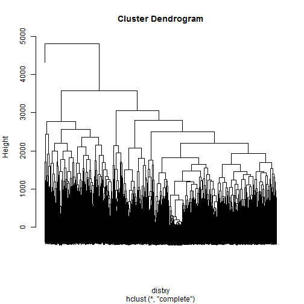
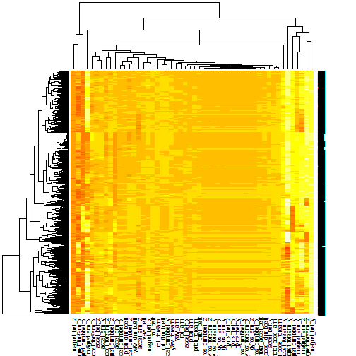
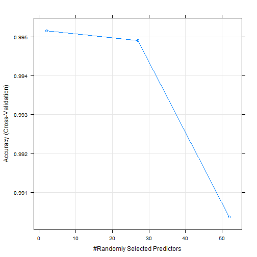

<!-- Make sure that the knitr package is installed and loaded. -->
<!-- For more info on the package options see http://yihui.name/knitr/options -->

<!-- Replace below with the title of your project -->

Predicting the Class of Weight Lifting Exercises
======================================================================

<!-- In the remainder of the document, add R code chunks as needed -->

### Executive Summary

In my study, a machine learning technique is presented to predict the class of weught lifting exercises. The original data is studied in [1]. The explanation of the classes and data can be found in [2]. 

While exploring the data, I saw many columns with mostly NA values and some with mostly empty. Hence, I removed those columns, i.e, corresponding variables/predictors from the data. I applies random forest technique for the prediction with 99.5% accuracy for the training data with 10-fold cross-validation. The accuracy on the test data is 100%.

While dandogram didnot show any clear patterns among the variables, heatmap showed some patterns for first 25 and last 5 variables. However, since I really was not 100% familiar with the data, I still included all the variables (remember I already removed many varibales with NA and blank values). 

### Exploratory Data Analysis:

This study involves exploring weight lifting exercise data. There are 160 variables (columns in the data). Each observation is classified with "classe" variable, which has 5 levels: A, B, C, D, E. The goal of this study is to come up with a prediction algorithm to accurately predict the class for each observation.

First order of business is to load the data. Also I will use caret package for prediction.


```r
library(caret)
```

```
## Loading required package: lattice
## Loading required package: ggplot2
```

```r
# load training data
data<-read.csv("pml-training.csv")
d<-data
datatest<-read.csv("pml-testing.csv")
dt <- datatest
```

Training data is a data frame with 19622 observations on 160 variables. "classe" is the category of the exercise we want to predict from other variables. Testing data is a data frame with 20 observations on 159 variables. In testing data obviously, "classe" variable is not included.

Inspection of the data showed that tehre are many columns mostly with NA and empty values. Clearly, we need to remove those variables from our study, as they will not provide any information for the prediction algorithm. This step also removes some observations where "DIVby0" error is detected. Luckily, those errors occur in the variables with mostly NA and blank values. Since we do this cleaning in training data set, we should do the same for testing data set.


```r
# replace empty cells with NA
d[d == ""] <- NA
# find out which columns has NAs
column.has.na <- apply(d, 2, function(x){any(is.na(x))})
sum(column.has.na)
```

```
## [1] 100
```

```r
# remove columns with NAs
d.noNA <- d[,!column.has.na]
dim(d)
```

```
## [1] 19622   160
```

```r
dim(d.noNA)
```

```
## [1] 19622    60
```

```r
# perform the same steps for testing data
dt[dt == ""] <- NA
column.has.na <- apply(dt, 2, function(x){any(is.na(x))})
sum(column.has.na)
```

```
## [1] 100
```

```r
dt.noNA <- dt[,!column.has.na]
dim(dt)
```

```
## [1]  20 160
```

```r
dim(dt.noNA)
```

```
## [1] 20 60
```

First seven variables also are not related to the exercise, as they are related to person, timestamp etc... Therefore, I removed them from the data, as they are really not related to exercise class at all.


```r
# remove first seven column not to be used by the model
d.cleaned <- d.noNA[,-c(1:7)]
dt.cleaned <- dt.noNA[,-c(1:7)]
dim(d.cleaned)
```

```
## [1] 19622    53
```

```r
dim(dt.cleaned)
```

```
## [1] 20 53
```

After these cleaning steps, there remains 60 variables to be used as predictors.

The next obvious step is to determine if there are any patterns discernable among the variables. First, let's take a look at the tree via the dandograms and see if the variables can clearly be separated.


```r
# pretty cluster plotting function
myplclust <- function(hclust, lab = hclust$labels, lab.col = rep(1, length(hclust$labels)),
hang = 0.1, ...) {
## modifiction of plclust for plotting hclust objects *in colour*! Copyright
## Eva KF Chan 2009 Arguments: hclust: hclust object lab: a character vector
## of labels of the leaves of the tree lab.col: colour for the labels;
## NA=default device foreground colour hang: as in hclust & plclust Side
## effect: A display of hierarchical cluster with coloured leaf labels.
y <- rep(hclust$height, 2)
x <- as.numeric(hclust$merge)
y <- y[which(x < 0)]
x <- x[which(x < 0)]
x <- abs(x)
y <- y[order(x)]
x <- x[order(x)]
plot(hclust, labels = FALSE, hang = hang, ...)
text(x = x, y = y[hclust$order] - (max(hclust$height) * hang), labels = lab[hclust$order],
col = lab.col[hclust$order], srt = 90, adj = c(1, 0.5), xpd = NA, ...)
}
# cluster plotting
distxy<-dist(d.cleaned[,-ncol(d.cleaned)])
hClustering <- hclust(distxy)
myplclust(hClustering)
```

 

The dandogram shows that it is really hard to determine if variables can be clustered together. This tells me it is wise to include all the variables as predictors. However, before we make our decision, let's take a look the heatmap as well.


```r
# heatmap plotting
heatmap(as.matrix(d.cleaned[,-ncol(d.cleaned)]))
```

 

As one can see, the first 25 and last 5 variables show some clear patterns. We could very much include only those variables in our prediction algorithm. On the other hand, I really want to predict with 100% accuracy for the test data, I take the safe path and decide to include all variables as predictors. 

Dendogram and heatmap analysis also shows one thing: it is really appropriate to utilize random forest algorithm. Because there are many variables with no particular clustering of variables. It is safe to establish different trees and take their averages for prediction, which random forest algorithm does.

### Prediction Modeling:

As mentioned above, I decided to use random forest algorithm. I utilize 10-fold cross-validation to train algorithm. Why 10? Because it is a good number to balance the following: processing speed, bias and variance. I cannot make it high number as it would incleare the variance of the prediction, and it would be costly in terms of processing. I want to reduce bias. I just picked 10. It could be another study to determine the effect of number of folds, which is beyond the scope.


```r
# cross validation parameters
tc <- trainControl("cv",10,savePred=T)
# random forest
modfit<-train(classe ~ ., method="rf", trControl=tc, data=d.cleaned)
```

```
## Loading required package: randomForest
## randomForest 4.6-7
## Type rfNews() to see new features/changes/bug fixes.
```

```r
modfit
```

```
## Random Forest 
## 
## 19622 samples
##    52 predictors
##     5 classes: 'A', 'B', 'C', 'D', 'E' 
## 
## No pre-processing
## Resampling: Cross-Validated (10 fold) 
## 
## Summary of sample sizes: 17661, 17659, 17659, 17660, 17660, 17660, ... 
## 
## Resampling results across tuning parameters:
## 
##   mtry  Accuracy  Kappa  Accuracy SD  Kappa SD
##   2     1         1      0.002        0.002   
##   30    1         1      0.002        0.003   
##   50    1         1      0.003        0.004   
## 
## Accuracy was used to select the optimal model using  the largest value.
## The final value used for the model was mtry = 2.
```


As you can see, the accuracy is 99.5% with 2 trees. This means the in-sample error is 0.5%. This is a pretty good result. Let's take a look at the confusion matrix.


```r
confusionMatrix(modfit)
```

```
## Cross-Validated (10 fold) Confusion Matrix 
## 
## (entries are percentages of table totals)
##  
##           Reference
## Prediction    A    B    C    D    E
##          A 28.4  0.1  0.0  0.0  0.0
##          B  0.0 19.3  0.1  0.0  0.0
##          C  0.0  0.0 17.3  0.2  0.0
##          D  0.0  0.0  0.0 16.2  0.0
##          E  0.0  0.0  0.0  0.0 18.3
```

Confusion matrix shows that errors occur for classes B, C and D. Now, let's determine the order of importance of the variables.


```r
varImp(modfit)
```

```
## rf variable importance
## 
##   only 20 most important variables shown (out of 52)
## 
##                      Overall
## roll_belt              100.0
## yaw_belt                87.4
## magnet_dumbbell_z       72.3
## pitch_belt              68.1
## pitch_forearm           66.0
## magnet_dumbbell_y       65.4
## roll_forearm            55.6
## magnet_dumbbell_x       55.3
## accel_belt_z            46.0
## accel_dumbbell_y        45.9
## roll_dumbbell           45.6
## magnet_belt_z           43.4
## magnet_belt_y           42.7
## accel_dumbbell_z        38.6
## roll_arm                37.5
## accel_forearm_x         35.3
## gyros_belt_z            32.6
## total_accel_dumbbell    30.4
## yaw_dumbbell            30.0
## magnet_forearm_z        28.9
```

In an extended version, I can include a prediction algorithm with only these top variables (instead of all 59 variables) and determine its accuracy, but I am already exceeding the limitation of this report. The following plot shows how the accuracy of the algorithm affected by the number of trees used.


```r
plot(modfit)
```

 

As one can see, interactions are not statistically significant (p > 0.05) and they can be excluded from the model.

### Model Testing:

Now, let's do the testing of the algorithm.


```r
answers<-predict(modfit,dt.cleaned)
answers
```

```
##  [1] B A B A A E D B A A B C B A E E A B B B
## Levels: A B C D E
```

The only way to determine the accuracy for the test data is to load the results. The result is 100%, which is pretty good.

### Conclusion:

Random forest with 10-fold cross-validation is used for the prediction of weight lifting exercise class. 100 of the variables are removed as they mostly inlcude NA and blank values and exercise unrelated data. In-sample error is 0.5%. The test data accuracy is 100%.  

### References:

[1] Velloso, E.; Bulling, A.; Gellersen, H.; Ugulino, W.; Fuks, H. Qualitative Activity Recognition of Weight Lifting Exercises. Proceedings of 4th International Conference in Cooperation with SIGCHI (Augmented Human '13) . Stuttgart, Germany: ACM SIGCHI, 2013.

[2] http://groupware.les.inf.puc-rio.br/har#weight_lifting_exercises#ixzz35KozQsFJ


